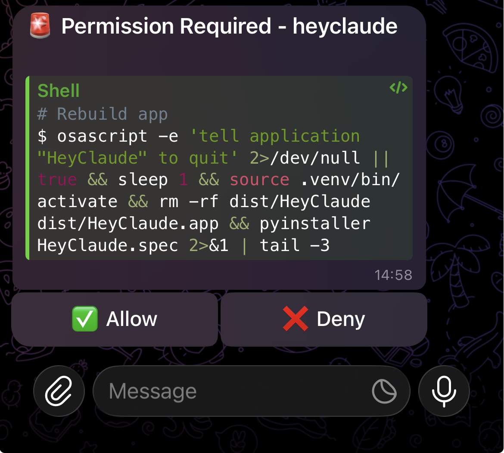

# HeyClaude

A macOS menubar app that sends notifications when Claude Code needs your attention.

## Features

- **Desktop notifications** when Claude is waiting for input or needs permission
- **Telegram notifications** with Allow/Deny buttons for remote approval
- **Idle detection** - only send Telegram notifications when you're away
- **Click to activate** - click notification to jump to your terminal



## Installation

### Homebrew (recommended)

```bash
brew tap Hugoch/heyclaude
brew install --cask heyclaude
```

### Manual

1. Download the latest release from [Releases](https://github.com/Hugoch/heyclaude/releases)
2. Unzip and move `HeyClaude.app` to `/Applications`
3. Open HeyClaude and click "Install Hook" from the menubar

## Configuration

Click the HeyClaude menubar icon → Preferences to configure:

- **macOS**: Enable/disable notifications, sound settings, terminal app
- **Telegram**: Bot token, chat ID (use "Get Chat ID" button), idle time threshold
- **Advanced**: Filter notification types (idle/permission)

### Telegram Setup

1. Create a bot with [@BotFather](https://t.me/botfather)
2. Copy the bot token to HeyClaude preferences
3. Send a message to your bot
4. Click "Get Chat ID" to auto-detect your chat ID
5. Click "Test Connection" to verify

## Building from Source

```bash
git clone https://github.com/Hugoch/heyclaude.git
cd heyclaude
python -m venv .venv
source .venv/bin/activate
pip install -e ".[build]"
make build
```

## License

MIT

---

*This project was co-authored with [Claude Code](https://claude.ai/claude-code) (Opus 4.5).*
